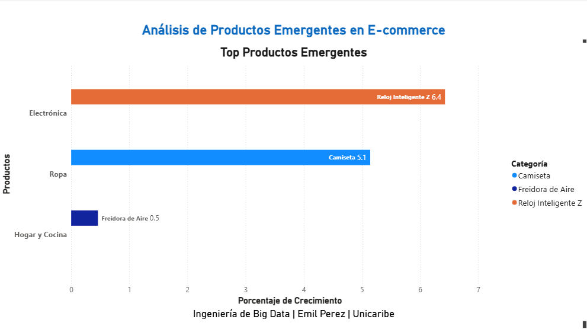
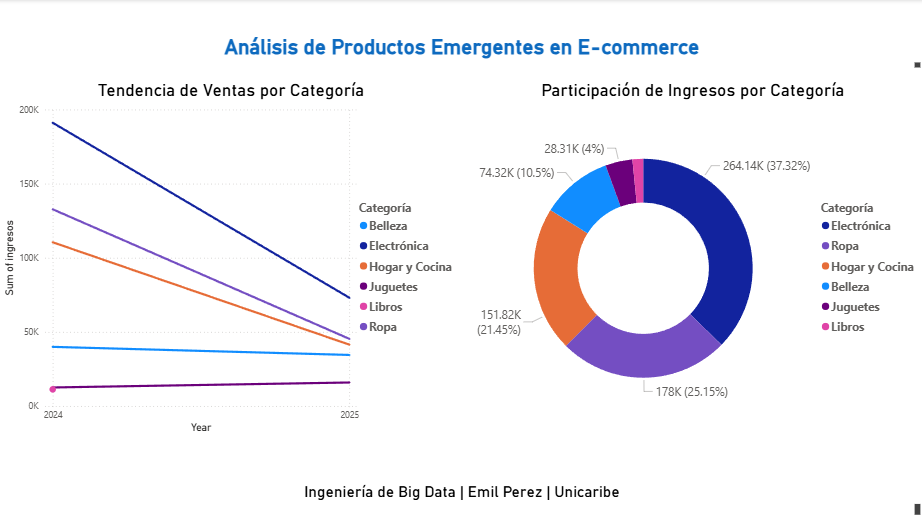

# 📊 Análisis de Productos Emergentes en E-commerce

## 📌 Descripción del Proyecto
Este proyecto identifica **productos emergentes por categoría** en un entorno de e-commerce, basándose en tendencias de ventas recientes.  
El flujo de trabajo está dividido en tres pasos principales:

1. **Carga de datos** desde un archivo CSV ya existente.
2. **Limpieza y preparación** de los datos.
3. **Detección de productos emergentes** según su crecimiento en ventas.

El resultado final incluye dos archivos exportados para análisis y visualización en **Power BI**.

---

## 🛠 Tecnologías Utilizadas
- **Python** (Pandas, NumPy)
- **Power BI** (Visualización de datos)
- **CSV** como formato de intercambio

---

## 📊 Visualización en Power BI

### Top Productos Emergentes

### Tendencia de Ventas por Categoría y Participación de Ingresos por Categoría

