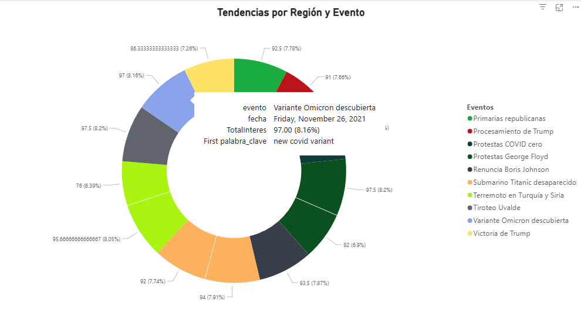

# 🌍 Proyecto: Análisis de Cambios de Interés Según Eventos Globales (Google Trends)

## 📌 Objetivo
Analizar cómo cambian los intereses de búsqueda en Google a nivel global y regional en respuesta a eventos importantes, identificando patrones y picos de popularidad antes, durante y después de cada evento.

---

## 📝 Descripción
Se utilizan datos de búsquedas **Google** sobre eventos globales ocurridos en 2020-2024 (Elecciones, Juegos Olímpicos, Bitcoin, Cambio Climático, Inteligencia Artificial).  
El análisis se realiza en **Python** y los resultados se exportan para su visualización en **Power BI**.

---

## 📊 Visualización en Power BI

### Tendencias por Región y Evento

