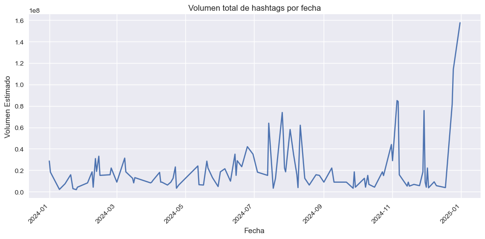
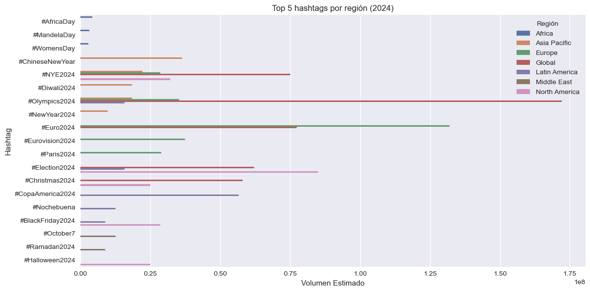

# 📊 Identificación de Temas en Auge por Región y Momento (Hashtags en Twitter)

## 📌 Objetivo
Este proyecto busca **identificar tendencias emergentes** en Twitter a través del análisis de hashtags, considerando **región geográfica** y **momento en el tiempo**. El fin es detectar patrones de crecimiento, picos de popularidad y variaciones geográficas para apoyar decisiones estratégicas en marketing, investigación social o monitoreo de eventos.

---

## 📝 Descripción
Se utiliza un dataset con hashtags que fueron tendencia durante el año 2024, incluyendo:
- Fecha de tendencia
- Región
- Hashtag
- Volumen estimado de menciones

El análisis se realiza en **Python** y los resultados se exportan para su visualización en **Power BI**.

---

## 📊 Visualización en MatPlotLib & Seaborn

### Volumen Total de Hashtags por Fecha

### Top 5 Hashtags por Región (2024)

